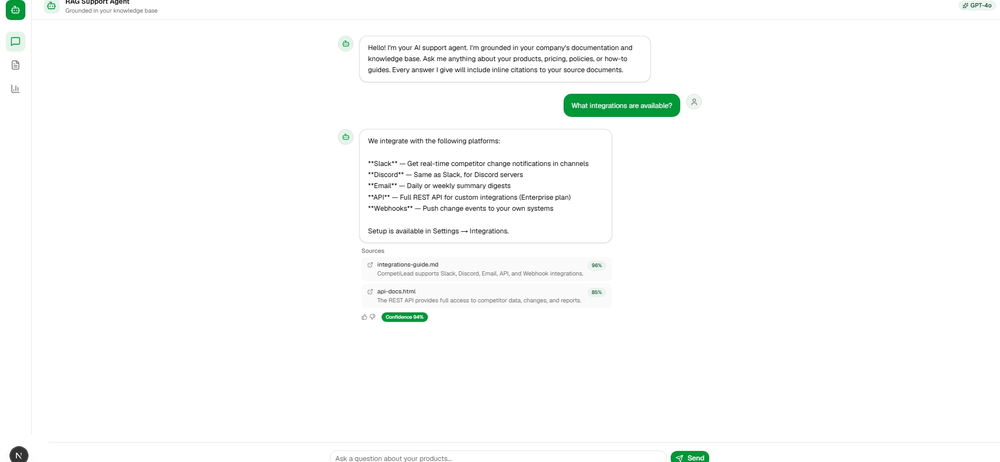
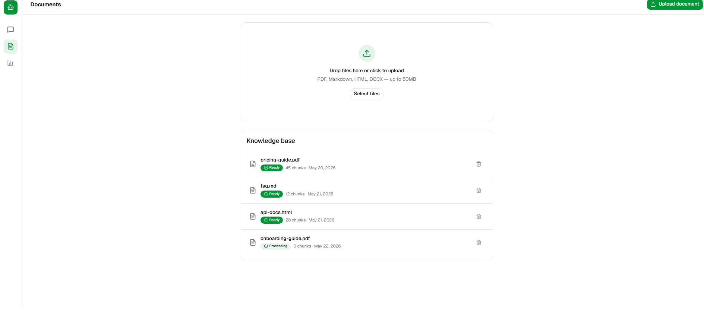

# RAG Support Agent — AI-Powered Customer Support

A production-grade Retrieval-Augmented Generation (RAG) agent that ingests company docs and generates grounded, citation-backed answers.

## Screenshots

| Chat Interface | Admin Dashboard |
|---|---|
|  |  |

## Tech Stack

| Layer | Technology |
|---|---|
| Backend | FastAPI (Python 3.12) |
| Frontend | Next.js 16 + TypeScript + Tailwind CSS v4 |
| LLM | GPT-4o (configurable) |
| Embeddings | text-embedding-3-large |
| Vector DB | Qdrant + pgvector |
| Orchestration | LangGraph |
| Reranker | Cohere Rerank v3 |

## Architecture

```
User Question
    │
    ▼
[Query Rewriter] ──► [Hybrid Retriever] ──► [Reranker] ──► Top 5 chunks
                                                              │
                                                              ▼
                                              [LLM with citation prompt]
                                                              │
                                                              ▼
                                              Answer + sources + confidence
```

## Getting Started

```bash
# Start services
docker compose up -d

# Install backend
cd apps/api && pip install -r requirements.txt

# Install frontend
cd apps/web && npm install

# Start backend
uvicorn apps.api.main:app --reload

# Start frontend
cd apps/web && npm run dev
```

## Features

- Document ingestion pipeline (PDF, MD, HTML, DOCX)
- Hybrid retrieval (vector + keyword) with reranking
- Citation-enforced generation
- Conversation memory across sessions
- Admin dashboard with analytics
- Multi-tenant knowledge base isolation

## License

MIT
